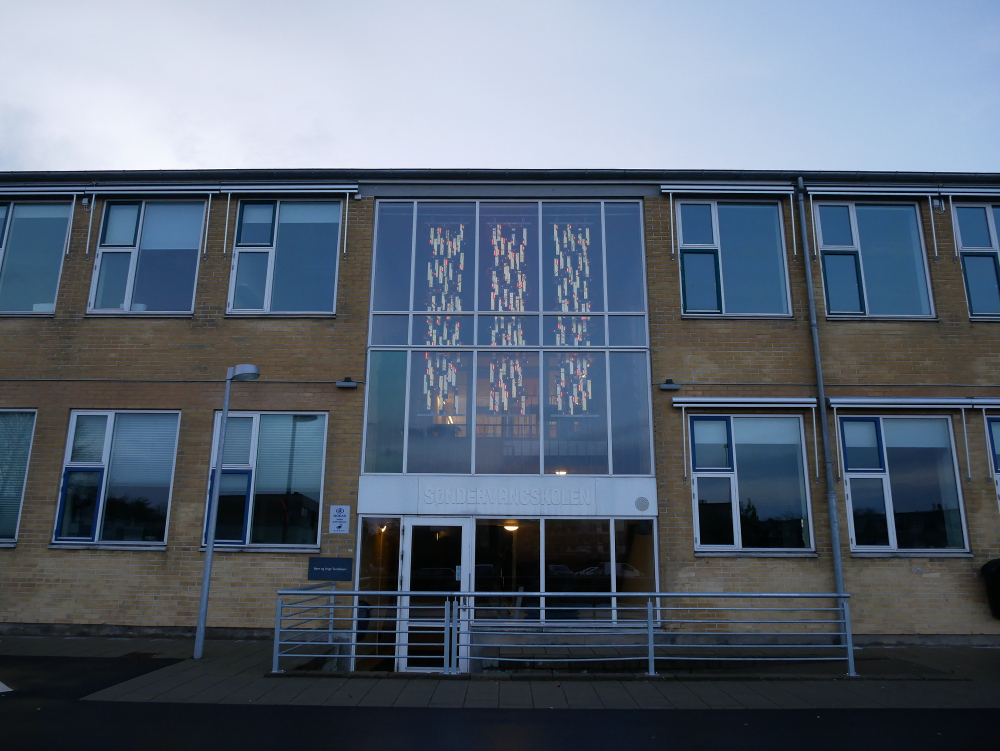
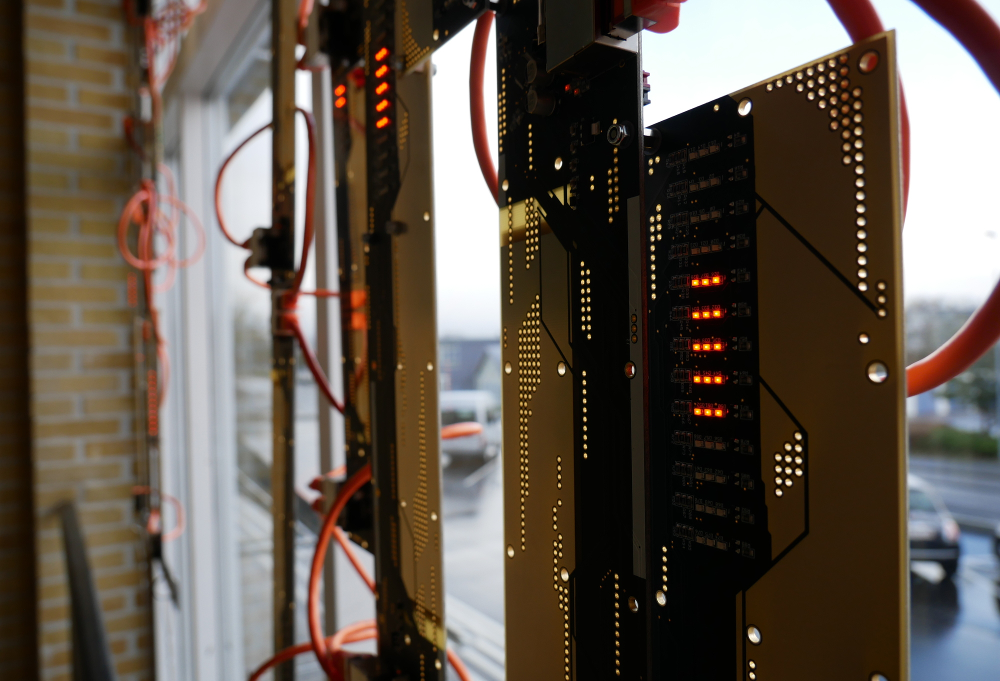

# cloud array
github repository for the tech side of the permanent installation "cloud array".

this installation lives permanently at [søndervangskolen](https://soendervangskolen.aarhus.dk/) in viby, århus, denmark. you can see the installation from the inside as well as the outside 24 hours a day, all year.

for more information visit this website www.jacobremin.com/cloudArray

